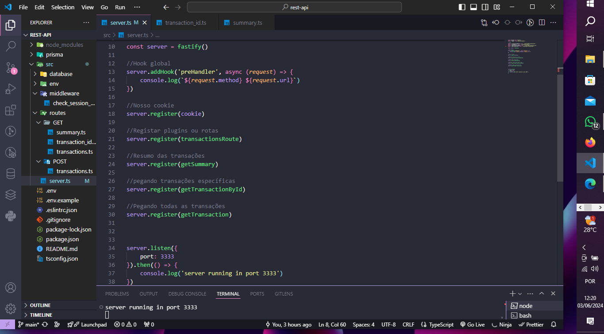
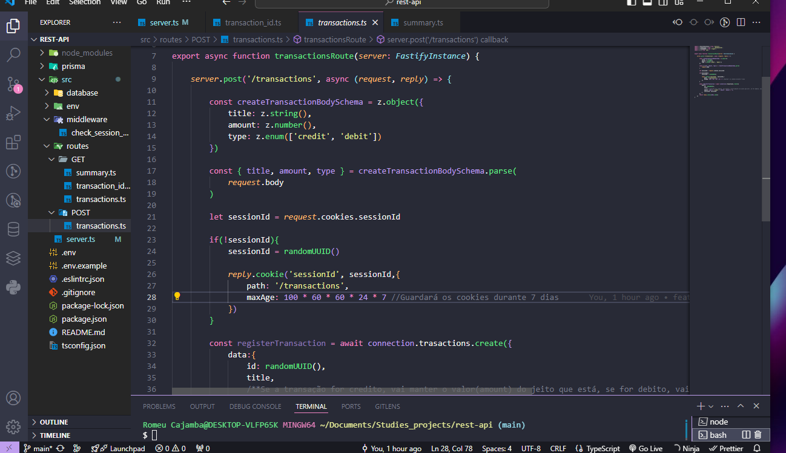
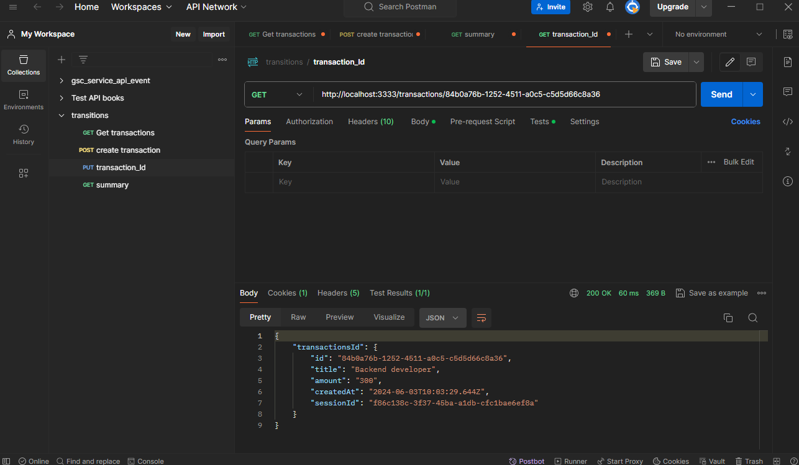
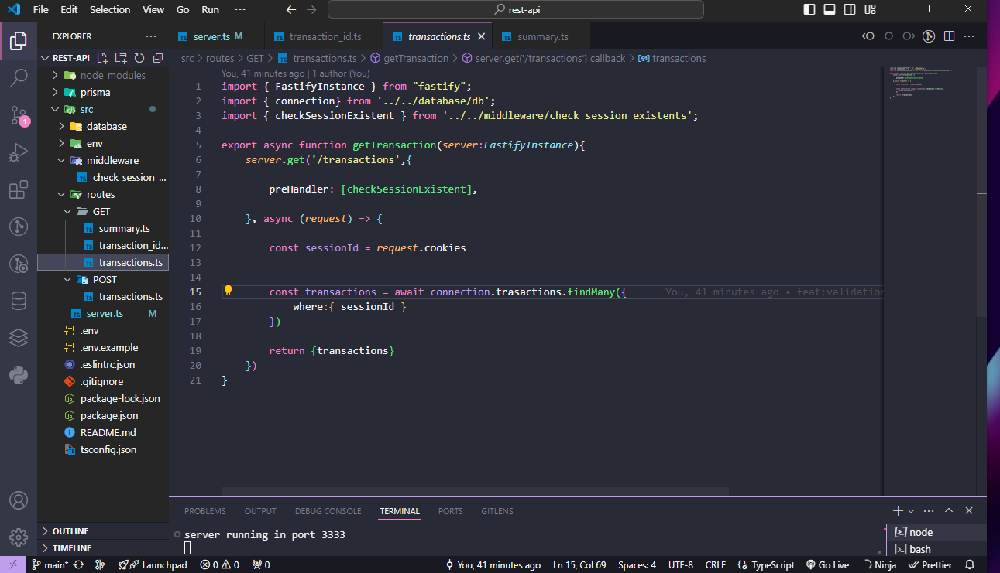
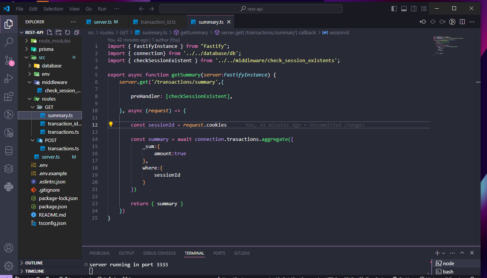
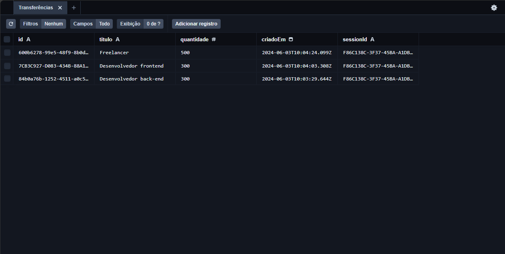
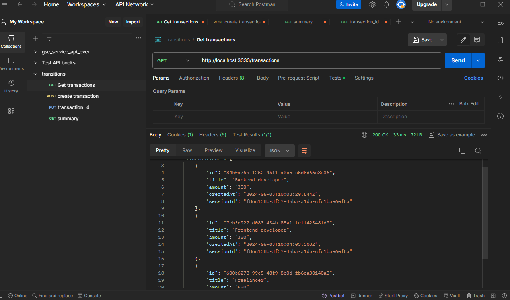
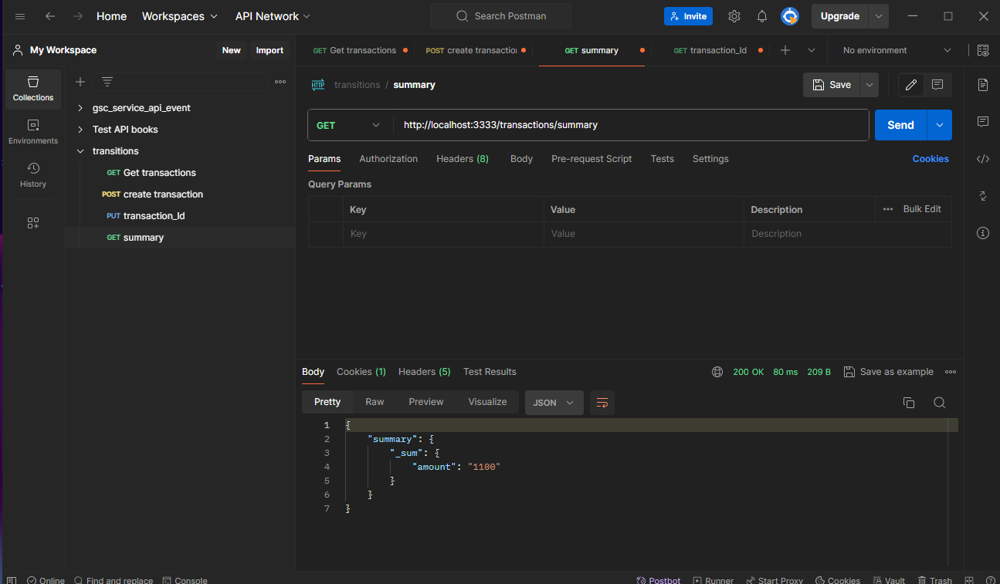
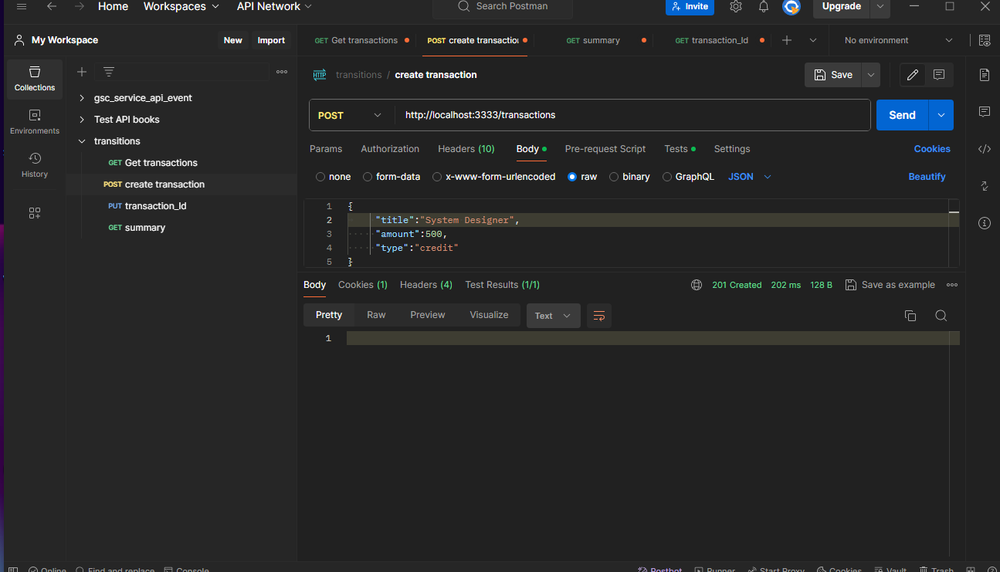

# Transações

Um sistema para criação de transações, permitindo a consulta de cada transação, ter o resumo das transações que ocorreram.

# Requisitos funcionais

- O usuário deve poder criar uma nova transação;
- O usuário deve poder obter um resumo da sua conta;
- O usuário deve poder listar todas transações que já ocorreram;
- O usuário deve poder visualizar uma transação única;

# Regras de negócio

- A transação pode ser tipo crédito que somará ao valor total, ou débito subtrairá;
- Deve ser possível identificarmos o usuário entre as requisições;
- O usuário só pode visualizar transações o qual ele criou;

## Dependências || tecnologias

## Nodejs

- Runtime javaScipt com o seu gerenciador de pacotes npm
- 

## JavaScript

- Liguagem de programação
- 

## Typescript

- Linguagem de programação para tipagens estáticas
- 

## Cookies
- npm i @fastify/cookie 

######
### 
###

######
####
##

